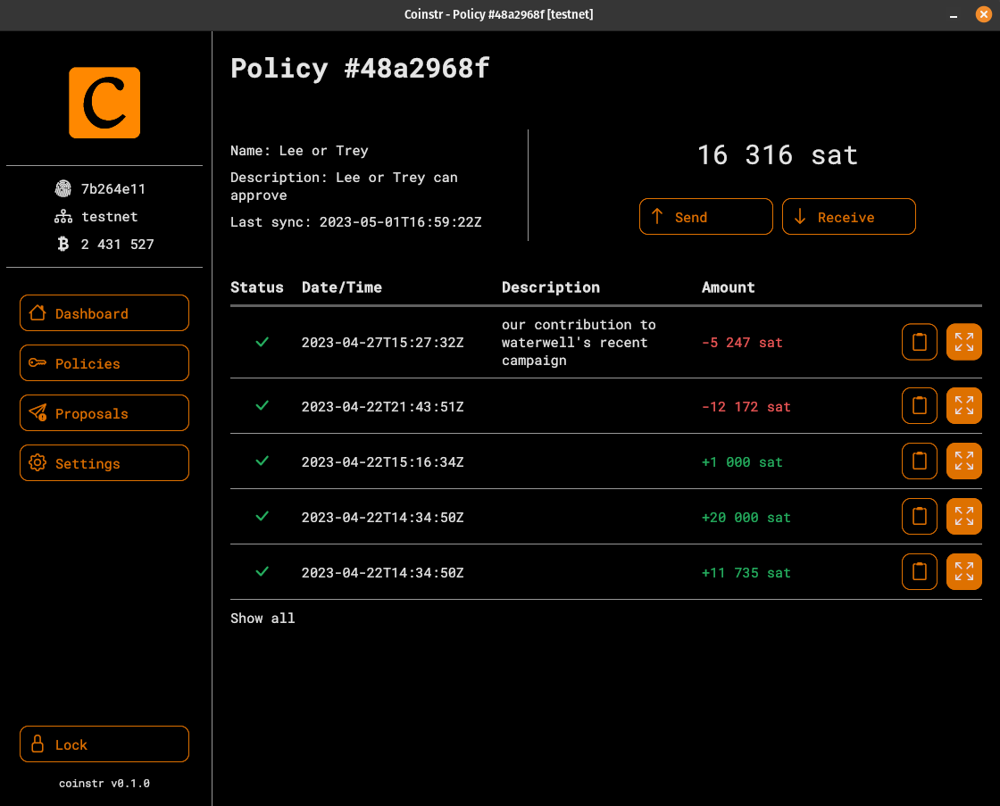

  
  <h2>Bitcoin Multi-Custody</h2>

₿ Coinstr is a bitcoin multi-custody protocol for spending policies and proposal execution.
 
🖆 Coinstr uses Nostr relays and clients for discovering signers, saving policies & PSBTs, and orchestrating signatures with workflow.
 
👨‍👩‍👧‍👦 Coinstr eliminates friction for groups managing Bitcoin together. 

## Quick Start

* [Build from source](doc/build.md)  
* [Usage](doc/usage/README.md) 

## Architecture

## Screenshots
Native GUI Dashboard & Policy Details 
 

 

      
Policy Editor

## Coinstr Product Video Playlist

## End-to-end spend tutorial

## State

⚠️ **This project is in an ALPHA state, use at YOUR OWN RISK and, possibly, with only testnet coins until release.** ⚠️

## License

This project is distributed under the MIT software license - see the [LICENSE](LICENSE) file for details
